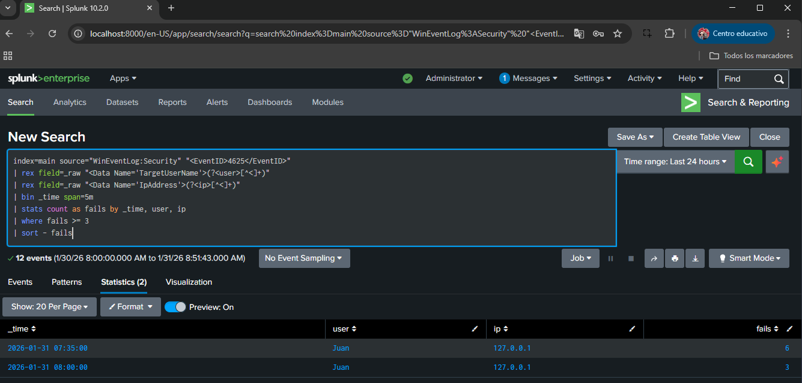
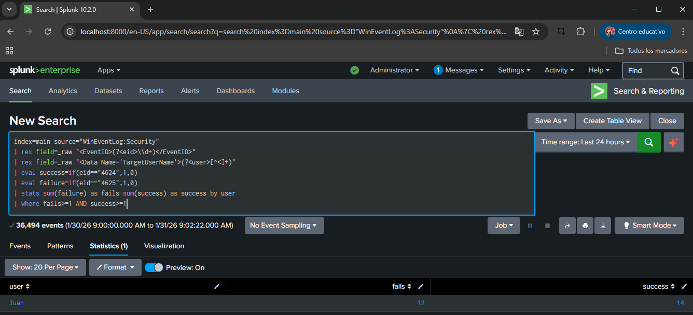

# SOC Windows Endpoint Detections with Splunk

This project implements a mini Security Operations Center (SOC) focused on detecting suspicious authentication activity on Windows endpoints using Splunk.

The goal of this project is to demonstrate practical SOC detection engineering skills, including log ingestion, detection logic design, correlation, and SOC-style documentation.

---

## Project Scope

- Windows endpoint authentication monitoring
- Detection of brute force login attempts
- Correlation of failed and successful logons
- Clear separation of SOC Tier 1 and Tier 2 detections
- Focus on high-signal detections rather than high-volume alerts

---

## Technology Stack

- Windows Security Event Log (XML)
- Sysmon
- Splunk Enterprise (Windows standalone)
- MITRE ATT&CK framework

---

## Repository Structure

detections/
├── brute_force/
│ ├── brute_force_xml_4625.spl
│ └── README.md
│
├── correlation/
│ ├── login_success_after_failures.spl
│ └── README.md
│
└── README.md

screenshots/
├── 01-windows-audit/
├── 02-sysmon/
├── 03-splunk-inputs/
├── 04-detections/
└── 05-triage/

---

## Detection Design Overview

The detection logic in this project is structured following common SOC operational practices.

- **Primary detections (Tier 1)**  
  Identify suspicious authentication behavior, such as repeated failed logon attempts.

- **Correlation detections (Tier 2)**  
  Increase confidence and severity by correlating multiple authentication events, such as failed logons followed by a successful login.

Each detection answers a specific SOC question:
- *Is suspicious authentication activity occurring?*
- *Has the suspicious activity resulted in a successful login?*

### Brute Force Authentication Detection (Tier 1)

This detection identifies repeated failed authentication attempts (Event ID 4625)
against a Windows endpoint, commonly associated with brute-force or password spraying activity.

### Correlation: Successful Login After Multiple Failures

This detection correlates multiple failed authentication attempts (Event ID 4625)
followed by a successful logon (Event ID 4624), indicating possible credential compromise.

### SOC Triage View

This view represents how correlated authentication alerts are presented
to a SOC analyst for validation and escalation.

## Additional Evidence

Additional screenshots showing Windows audit configuration, log ingestion,
and intermediate detection steps are available in the `/screenshots` directory.

---

## Data Ingestion and Parsing Approach

Windows Security authentication events (4624/4625) were ingested in XML format.

As EventCode was not normalized, detections were implemented by parsing EventID directly from the raw XML, which is a common approach in Splunk environments without the Windows TA.

This reflects realistic constraints often found in standalone Splunk deployments.

---

## MITRE ATT&CK Coverage

- **T1110 – Brute Force**
- **T1078 – Valid Accounts**

These techniques were selected to demonstrate both pre-compromise
(brute force) and post-compromise (valid account usage) detection scenarios.

---

## SOC Analyst Perspective

### SOC Tier 1
- Monitor brute force authentication alerts
- Perform initial triage and alert validation
- Identify and filter false positives

### SOC Tier 2
- Investigate correlated authentication events
- Assess potential account compromise
- Escalate incidents and recommend response actions

---

## What This Project Demonstrates

- Windows authentication log analysis
- SPL-based detection logic
- Event correlation for alert fidelity
- SOC Tier 1 → Tier 2 escalation thinking

---

## Disclaimer

All events were generated in a controlled lab environment for learning and demonstration purposes only.
